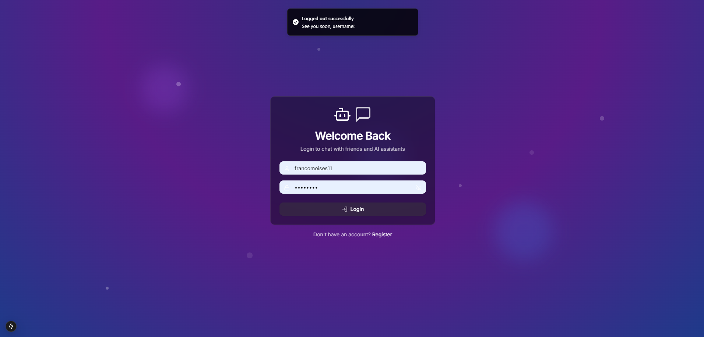
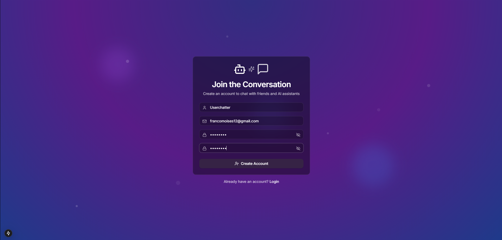
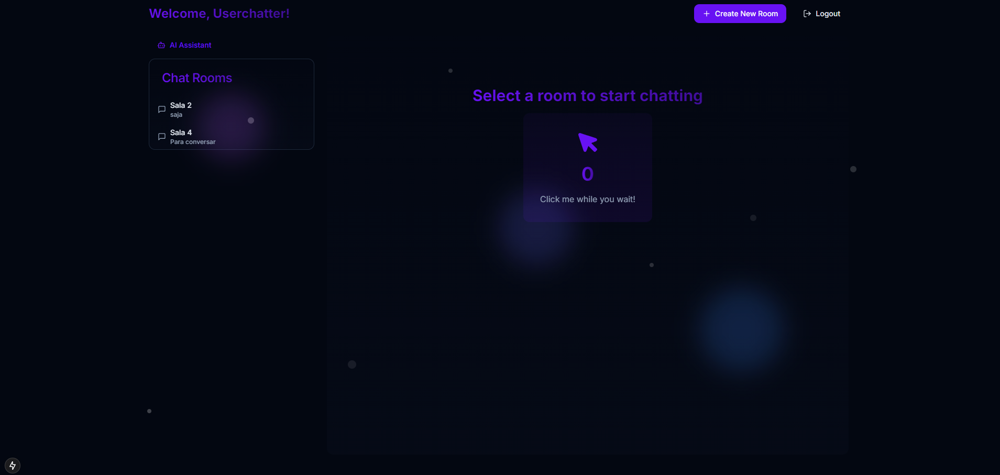
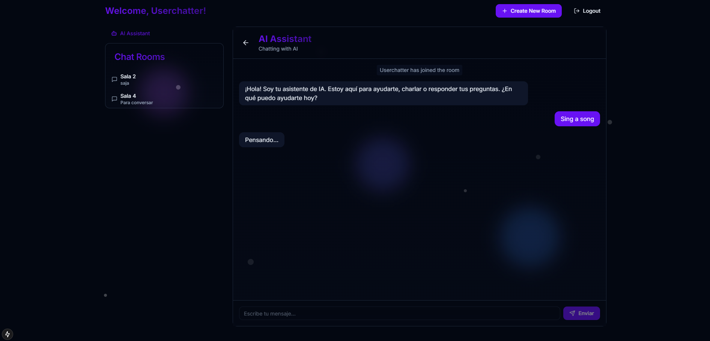
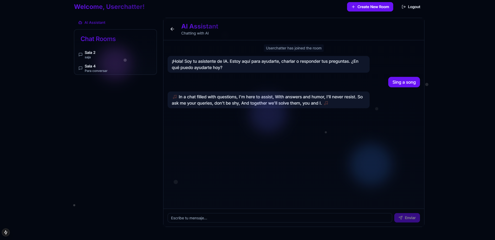
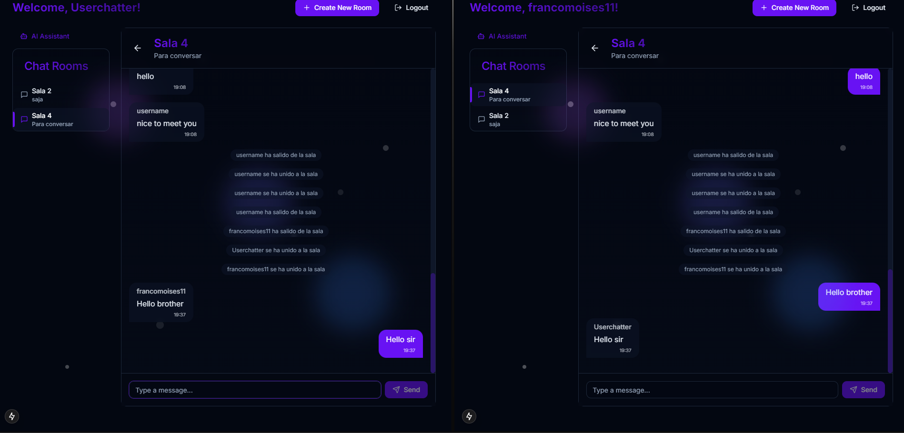

# .NET-SignalR-Nextjs-Chat-App
This project is a real-time chat application built using .NET SignalR for live communication and Next.js for the front end. Users can chat seamlessly with each other and also interact with an integrated AI chatbot for an enhanced conversational experience.

## Description
- **Backend**: Built with .NET and SignalR to handle real-time communication between users and the AI chatbot.
- **Frontend**: Developed using Next.js for a modern and responsive user interface.

## Setup Instructions
### Prerequisites
Make sure you have the following installed:
- .NET SDK (version 6.0 or higher)
- Node.js (version 16.x or higher)
- npm or yarn (for frontend dependencies)

### Backend Setup
1. Navigate to the `backend/ChatApp` directory:
   ```bash
   cd backend/ChatApp
   ```
2. Restore the .NET dependencies:
   ```bash
   dotnet restore
   ```
3. Run the application:
   ```bash
   dotnet run
   ```
### Frontend Setup
1. Navigate to the frontend directory:
   ```bash
   cd frontend
   ```
2. Install dependencies:
   ```bash
   npm install
   ```
3. Create a .env file in the frontend directory with the following content:
   ```bash
   GEMINI_API_KEY=<your-gemini-api-key>
   GEMINI_API_URL=<your-gemini-api-url>
   Replace <your-gemini-api-key> and <your-gemini-api-url> with the appropriate values for your Gemini API.
   ```
4. Start the Next.js development server:
   ```bash
   npm run dev
   ```
5. Running the Full Application
Start the backend server first, followed by the frontend server.
Open http://localhost:3000 in your browser to use the chat application.


## Features
- Real-time user-to-user chat using SignalR.
- AI chatbot integration powered by Gemini API.
- Modern and responsive interface with Next.js.
  
## Author
FJMoisesRomero
GitHub: FJMoisesRomero

# Demo Video
[](https://www.youtube.com/watch?v=1MAGtbeMDmE&ab_channel=francomoises)

## Images 📸




 

